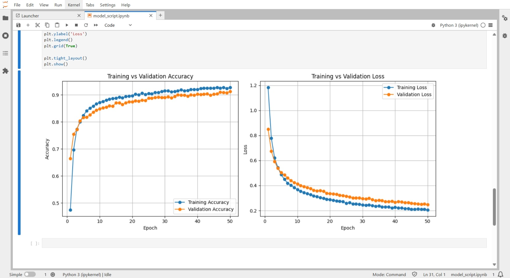

# 🧠 Brain Tumor Detection and classification

## 📝 Description

The script consists of a machine learning pipeline in Tensorflow using Transfer learning. 

### 📄 Dataset

You can acces the dataset on kaggle : [Brain Tumor MRI Dataset](https://www.kaggle.com/datasets/masoudnickparvar/brain-tumor-mri-dataset)

The dataset consistis of 2 sets, one for training and another for validation.
Each have 4 categories of images - glioma, meningioma, pituitary and No Tumor.
The dataset consists of ~7000 images total.

It is loaded using image_from_directory method in tensorflow and further processed.

### 🚀 Model

Transfer learning using MobileNetV2 is used to load base model and few layers are designed further.

The output of final Epoch is observed as:
```bash
Epoch 50/50
179/179 [==============================] - 212s 1s/step - loss: 0.2044 - accuracy: 0.9272 - val_loss: 0.2475 - val_accuracy: 0.9123
```
### 📊  Accuracy and loss Graphs : 

