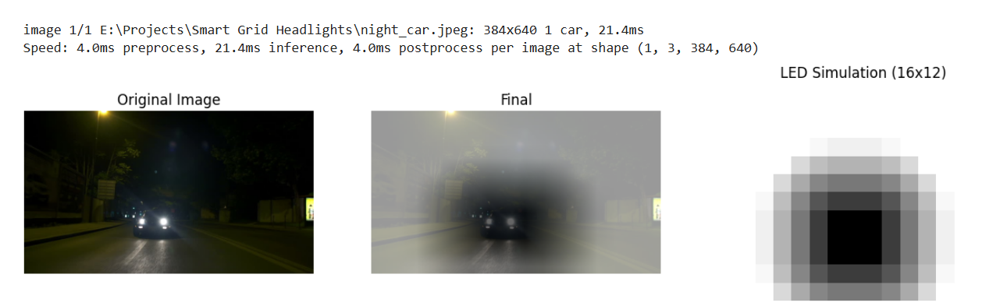

# 🚗 AI based Smart Grid-Headlights

## 📝 Description

The script consists of a python code to simulate grid headlights using computer vision. 
(install required dependencies in order to run the file)

### 📄 Problem

Night driving is often made dangerous by glare from oncoming vehicles’ headlights. Traditional car headlights provide uniform illumination and cannot adapt to dynamic road conditions, which can temporarily blind drivers and increase the risk of accidents. There is a need for an intelligent headlight system that can detect vehicles in real time and adjust the light distribution dynamically, reducing glare for other drivers while maintaining optimal road visibility. 

### 🚀 Solution

My solution is an AI-powered smart headlight system that adapts to dynamic driving conditions. It uses real-time vehicle detection to identify oncoming traffic and divides the headlight into a grid for precise light control. Sections corresponding to detected vehicles are dimmed to reduce glare, while other areas remainilluminated for optimal visibility..
In this prototype, Yolov8n (~3.2M parameters) trained on coco dataset is the model used to detect vehicles at night. With availability of desired dataset we could build custom model by using Transfer learning vis models like lighter versions of MobileNet, yolo, etc. 

### 📊  Software simulated output : 

